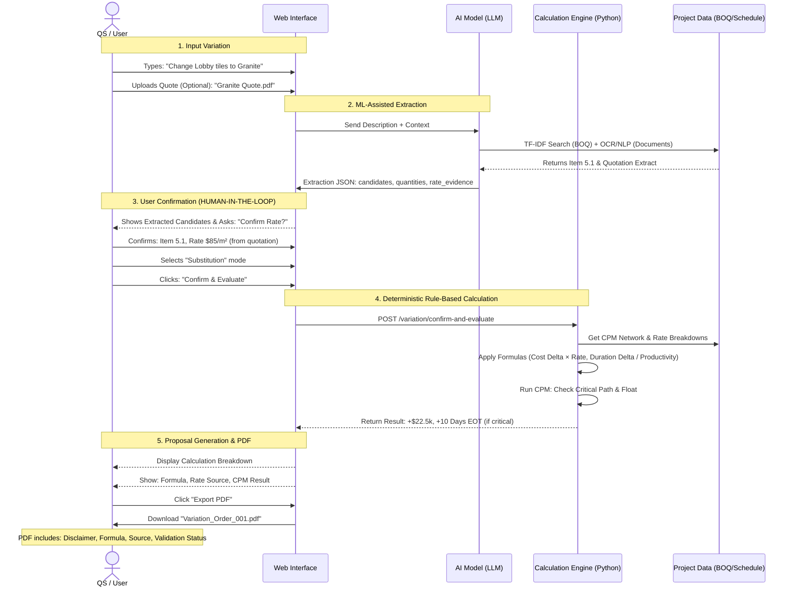

# User Flow & Example Scenario - Hybrid Rule-Based & ML-Assisted Evaluation

## 1. Concrete Scenario: "Lobby Flooring Change"

**Context**:

- **Project**: High-rise Commercial Building.
- **Current Status**: Superstructure complete, internal finishes starting next month.
- **Original Scope**: 500 m² of _Ceramic Tiles_ in the Main Entrance Lobby.
- **Variation Request**: Client wants to upgrade to _Granite Slabs_ for a premium look.

### Input Data

- **Original BOQ Item**: `Item 5.1: Supply and lay 600x600 Ceramic Tiles - $40/m²`.
- **Rate Breakdown (Ceramic)**: Material ($25), Labor ($10), Plant ($2), Overheads ($3).
- **Schedule**: Activity `ID-105: Lobby Flooring` (Duration: 10 days, 50m²/day). Starts: Day 100.
- **Variation Description (User Input)**: "Change Main Lobby flooring from Ceramic to Granite. Thickness 20mm."

---

## 2. System Processing (Hybrid Approach)

### Step A: ML-Assisted Extraction & Candidate Matching (The "Understanding" Layer)

The AI (Groq/Qwen) analyzes the text input using OCR/NLP to extract structured data:

1.  **Identifies Scope**: "Change" means _Omission_ of old item + _Addition_ of new item.
2.  **Candidate search**: TF-IDF similarity finds "Granite" items in BOQ or similar projects.
3.  **Rate evidence search**: Searches quotations, BSR, HSR for granite laying rates.
4.  **Productivity evidence**: Looks for schedule-derived or norm-based productivity data.

### Step A-2: User Confirmation (Human-in-the-Loop)

- **System shows extracted candidates**: "Matched to Item 5.1 Ceramic Tiles. Found 3 quotations for Granite."
- **User confirms**: Selects Item 5.1, provides new rate ($85/m²) or accepts quoted rate.
- **Mode Selection**: The UI presents the AI's findings and asks the user to select the **Variation Mode**:
  - **[Omission]** (Remove item only)
  - **[Addition]** (Add new item only)
  - **[Substitution]** (Remove old + Add new - _Selected for this scenario_)

### Step B: Deterministic Rule-Based Calculation (The "Math" Layer)

The Python Engine executes ONLY when user confirms:

1.  **Cost Calculation (Omission)**:
    - Formula: `cost_impact = (new_quantity - original_quantity) × selected_rate`
    - `(0 - 500) × $40 = -$20,000` (Credit)

2.  **Cost Calculation (Addition)**:
    - **Star Rate creation**: Evidence-based derivation
    - **Rate source priority**:
      1. Similar BOQ item ($85)
      2. Quotation evidence ($88)
      3. BSR/HSR norms
      4. Manual QS input
    - **Selected Rate**: $85/m² (from quotation evidence)
    - **Result**: `500m² × $85 = +$42,500`
    - **Net Cost Impact**: `+$22,500`

3.  **Time Calculation (CPM)**:
    - Formula: `duration_delta = quantity_delta / confirmed_productivity`
    - Original Duration: `500m² / 50m²/day = 10 days`
    - New Productivity (from quotation or HSR): `25 m²/day`
    - New Duration: `500m² / 25m²/day = 20 days`
    - Delay: `+10 days`
    - **Critical Path Check**: If `ID-105` is on the Critical Path, Project EOT = 10 Days. If it has 15 days Float, EOT = 0 Days.

---

## 3. User Flow Diagram

---

## 4. Why This Flow?

- **Speed**: User doesn't type lines of calculations. They just confirm AI-extracted data.
- **Control**: User _confirms_ the AI's suggestions before math happens. Prevents "hallucinations" in contracts.
- **Transparency**: The final numbers come from deterministic `ENG` (Math Engine), not the `AI`.
- **Professional**: Audit trail shows rate source, formula, human confirmation - defensible in disputes.
- **Research**: Demonstrates hybrid approach: AI for intelligence, rules for precision.
